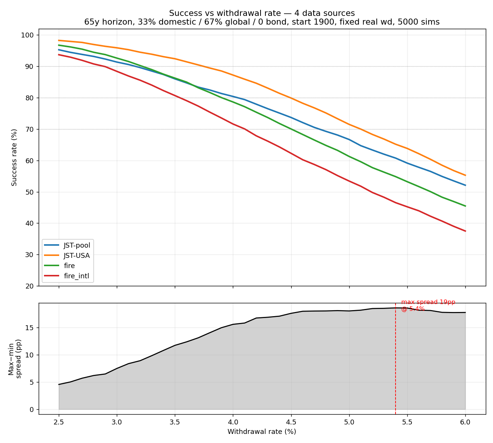

# SWR Sensitivity: Four Data-Source Options × Start Year

**Date:** 2026-06-02
**Setup:** fixed real withdrawal, allocation 30/60/10 (domestic/global/bond),
30-year retirement, block bootstrap (block 5–15y), 5000 sims, seed 42, expenses 0.
"SWR@X%" = highest withdrawal rate whose success rate ≥ X%.

## The four options

| Option | data_source | country | non-US equity treatment |
|---|---|---|---|
| **JST-pool** | jst | ALL (16-country, sqrt-GDP pooled) | every sampled country's own domestic + ex-country global |
| **JST-USA** | jst | USA | US domestic + GDP-weighted ex-US (JST, "hot") |
| **fire** | fire_dataset | USA | MSCI EAFE post-1970, **US-placeholder pre-1970** |
| **fire_intl** | fire_dataset_intl | USA | MSCI post-1970, **JST-calibrated backfill pre-1970** |

`data_start_year` sets the bootstrap **sampling pool** (not a single path). Pool
sizes: US-only options have 26–154 calendar years; JST-pool has 416–2340
country-years (16× richer).

## SWR @ 90% success

| start | pool (US-only) | JST-pool | JST-USA | fire | fire_intl |
|---|---:|---:|---:|---:|---:|
| 1871 | 154y | 4.25% | **4.99%** | 4.58% | 4.29% |
| 1900 | 126y | 4.01% | **4.77%** | 4.34% | 4.08% |
| 1929 | 97y  | 4.29% | **5.03%** | 4.20% | 4.36% |
| 1950 | 76y  | 4.61% | **5.49%** | 4.72% | 4.82% |
| 1970 | 56y  | 4.43% | **5.17%** | 4.61% | 4.61% |
| 1985 | 41y  | 5.58% | **5.73%** | 5.11% | 5.11% |
| 2000 | 26y  | 4.21% | **4.49%** | 4.10% | 4.10% |

(SWR@95% follows the same ordering, ~0.4–0.9pp lower across the board.)

## Success-rate curve at full pool (start=1871)

| withdrawal | JST-pool | JST-USA | fire | fire_intl |
|---|---:|---:|---:|---:|
| 3.5% | 95.6% | 98.4% | 98.6% | 96.6% |
| 4.0% | 92.0% | 97.3% | 95.4% | 93.0% |
| 4.5% | 87.6% | 94.4% | 91.0% | 87.6% |
| 5.0% | 82.9% | 89.9% | 84.5% | 80.4% |
| 5.5% | 77.2% | 83.8% | 77.9% | 72.2% |

## Insights

### 1. Ranking is stable: JST-USA (optimistic) > fire > fire_intl ≈ JST-pool (humble)
JST-USA sits highest almost everywhere — it stacks the two most optimistic
ingredients: US domestic equity (the single best-performing market in history)
and JST's hot GDP-weighted ex-US. JST-pool sits lowest — pooling 16 countries
injects the full spread of national outcomes (stagnations, war-era losses),
removing US survivorship bias. The gap JST-USA − JST-pool ≈ **0.7–0.9pp** is
the "US-exceptionalism premium" baked into any US-only backtest.

### 2. The backfill pulls `fire` toward the credible (humble) regime
At full history (1871) `fire_intl` = 4.29% lands **almost exactly on JST-pool
(4.25%)**, while the placeholder `fire` = 4.58% is inflated by ~0.3pp. Because
the pre-1970 international leg in `fire_intl` is JST-calibrated, it inherits
JST's humility — so the US-centric dataset starts behaving like the global pool
over long history. This is a useful consistency result: the backfill is not
arbitrary, it converges the two independent pipelines.

### 3. The backfill effect is small AND sign-varying
`fire_intl − fire` (SWR@90%): 1871 −0.29pp, 1900 −0.26pp, 1929 **+0.16pp**,
1950 +0.10pp, ≥1970 0.00pp (verified — backfill only touches pre-1970).
- When the pool is dominated by quiet pre-1970 decades (1871/1900), the **level
  effect** dominates: real non-US is lower than the US-placeholder → SWR drops.
- When the pool is crash-heavy (1929 = Depression), the **decorrelation effect**
  dominates: the placeholder makes international a perfect crash-twin of the US
  (corr=1), doubling the drawdown; the real backfill (corr ~0.3) decouples them
  and softens the worst sequences → SWR *rises*. This is exactly the
  diversification structure the placeholder destroyed.

### 4. Start year (which regime you sample) dominates data-source choice
Within-source spread across start years is **1.0–1.6pp**; across-source spread
at a fixed start is only **0.4–0.9pp**. The benign 1985–2025 pool gives the
highest SWR (~5.1–5.7%); the crash-heavy, short 2000–2025 pool the lowest
(~4.1–4.5%). **Caveat:** recent pools (start ≥1985, ≤41y, with 5–15y blocks)
heavily reuse sequences and lack a full prolonged bear — their optimism is a
small-sample artifact, not a real higher safe rate. JST-pool is the exception
that stays well-sampled even at start=2000 (416 country-years).

### 5. At higher withdrawal rates fire_intl is the most conservative
At 5.0–5.5% (start 1871), fire_intl falls slightly **below** even JST-pool
(80.4% vs 82.9% at 5.0%). A US-only sequence with realistically-lower,
decorrelated international has less tail support than a genuinely diversified
16-country pool — pooling helps the tail more than decorrelation alone.

## Follow-up recommendations

1. **Anchor planning on JST-pool or fire_intl, not JST-USA/fire.** The ~0.5–0.9pp
   higher SWR of the US-only views is the US-exceptionalism premium you should
   not bank on for a forward 30-year plan. Memory already prefers JST-pool as the
   non-US-investor baseline; this study quantifies why.
2. **Treat start ≥1985 pools as optimistic scenarios, not baselines.** Report
   them as "recent-regime" sensitivity, flagged as small-sample.
3. **The exact pre-1970 wedge isn't worth over-tuning** (≤0.3pp impact for a US
   investor) — but keeping the backfill (vs placeholder) is worth it for the
   *directional* correctness it restores (real diversification in crash pools).
4. **Next analyses worth running:**
   - Repeat under a **guardrail / dynamic** strategy (fixed withdrawal is the
     harshest; guardrails should compress the cross-source spread).
   - Use the **user's real allocation** (China-domestic tilt per memory, lower
     global %) instead of 30/60/10 to see if the ordering holds.
   - Add a **funded-ratio / CEW** lens, not just SWR@success — the tail behavior
     in insight #5 deserves a utility-weighted view.

## Addendum: 65-year horizon, 33% domestic / 67% global / 0 bond

A second, more demanding base case (long/early-retirement, all-equity). Same
method otherwise (fixed real withdrawal, block 5–15y, 5000 sims, seed 42).

### Success @ 3.5% across start years

| start | JST-pool | JST-USA | fire | fire_intl |
|---|---:|---:|---:|---:|
| 1871 | 89.1% | **94.8%** | 90.0% | 86.1% |
| 1900 | 86.0% | **92.4%** | 86.2% | 80.7% |
| 1929 | 88.1% | **94.8%** | 80.9% | 83.6% |
| 1950 | 92.0% | **98.2%** | 91.6% | 92.6% |
| 1970 | 89.3% | **96.1%** | 87.4% | 87.4% |
| 1985 | 96.8% | **98.0%** | 94.9% | 94.9% |
| 2000 | **76.7%** | 73.6% | 58.8% | 58.8% |

- 3.5% over 65y is **not** bulletproof for all-equity: ~59–98% depending on
  regime. (Funded ratios stay 86–99%, so most failures land late in the window.)
- The backfill effect is **amplified ~10–20×** vs the 30y case: `fire_intl − fire`
  reaches −5.6pp (1900) and +2.7pp (1929) — pre-1970 non-US treatment is now a
  first-order driver over long horizons.
- **start=2000 is the cautionary case:** US-only options collapse to 58.8%, while
  JST-pool holds 76.7% (+18pp) — the only start where the global pool *beats*
  JST-USA, because the 26-year US-only pool is uniquely crash-dominated and the
  416-country-year global pool stays diverse.

### Success-rate curves, start=1900 (where they agree vs differ)

| withdrawal | JST-pool | JST-USA | fire | fire_intl | max−min spread |
|---|---:|---:|---:|---:|---:|
| 2.5% | 95.3 | 98.2 | 96.7 | 93.7 | 4.6pp |
| 3.0% | 91.3 | 95.9 | 92.6 | 88.4 | 7.5pp |
| 3.5% | 86.0 | 92.4 | 86.2 | 80.7 | 11.7pp |
| 4.0% | 80.4 | 87.2 | 78.6 | 71.6 | 15.6pp |
| 5.0% | 66.7 | 71.5 | 61.3 | 53.4 | 18.1pp |
| 5.5% | 59.1 | 63.8 | 53.2 | 45.2 | **18.6pp** |

**Where they agree:** at low rates (≤3%) the spread is only ~4.6–7.5pp — a floor
effect, all sources cluster at 88–98%. Data-source choice barely matters here.

**Where they differ:** the spread grows monotonically with the rate, peaking at
**~18–19pp around 5.0–5.5%** — i.e. the disagreement is largest exactly in the
decision-relevant SWR zone. The more you try to withdraw, the more the source
choice dominates the answer.

**Crossover at ~3.5–3.7%:** below it the US-tilted views (JST-USA, fire) sit on
top (high US level wins); above it **JST-pool overtakes fire** — under high
withdrawal stress, tail risk dominates and the diversified global pool's tail
support beats the US-only sequence. Two persistent gaps frame the band:
JST-USA is always highest (US-exceptionalism premium, mean +5.2pp), and
`fire_intl` is lowest at this start (single-country + realistic lower/decorrelated
non-US → thinnest 65y tail; mean −6.5pp vs the inflated placeholder `fire`).

## Reproduce
Transient scripts (not committed). Imports `pregenerate_return_scenarios` +
`sweep_withdrawal_rates`; pooled path via `get_country_dfs` + `get_gdp_weights`;
chart via matplotlib. **Gotcha:** `filter_by_country` defaults
`data_start_year=1970` — pass the real start year or pre-1970 history is silently
truncated.
